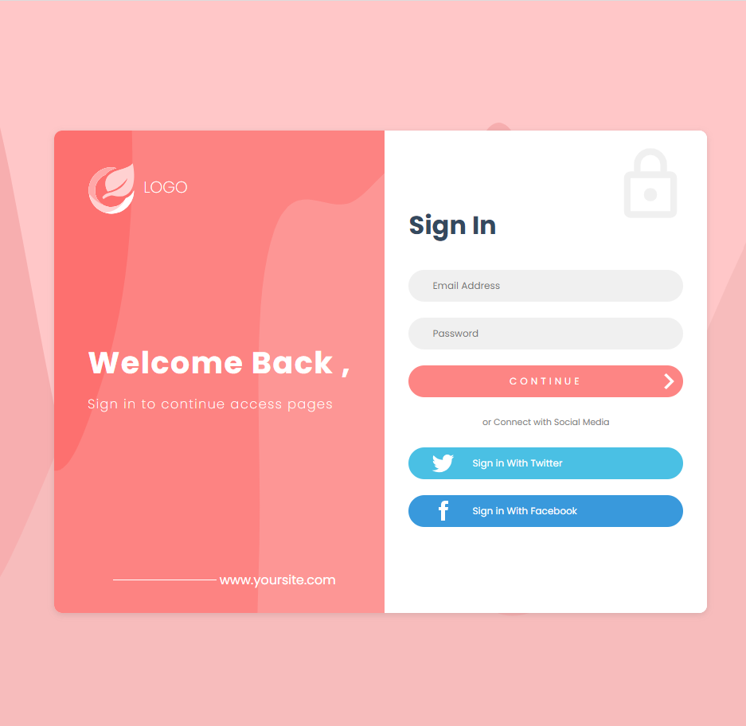

# Practica 3: Login

## **Descripción**
    Maquetación de login, con HTML y CSS puro, donde contiene logo y botones de redireccionamiento para diferentes inicios de sesión.

## **Previsualización de proyecto**

## **Pasos de Instalación**

Siga estos pasos para instalar y ejecutar el proyecto localmente:

1. Clone el siguiente repositorio:

    ```proweshell
    git clone https://github.com/SamuelCM123/tasks.git
    ```

2. Abrir el archivo index.html o correr la extension liver server.

## Contacto
    Si tienes alguna pregunta o comentario, no dudes en contactarme, correo:samuel.calderon@cistem.com.mx.

## Personalización
    Si deseas personalizar el sitio, puedes editar el archivo `css/styles.css` para cambiar los estilos y actualizar el contenido en `index.html`.
